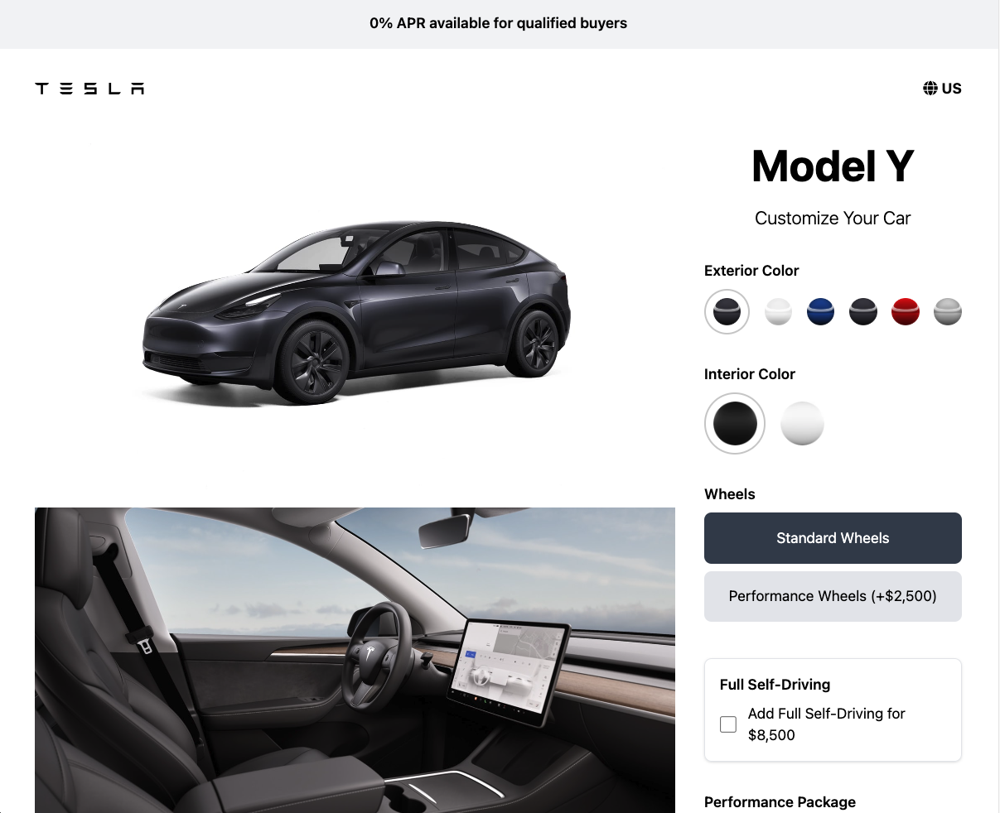

# Tesla Model Y Configurator

This project is a **Tesla Model Y Configurator** interface, created as a part of a YouTube tutorial by [Brad Traversy](https://www.youtube.com/@TraversyMedia). The interface allows users to configure a Tesla Model Y using **HTML**, **Tailwind CSS**, and **JavaScript**.

## 📖 Project Overview

This tutorial demonstrates how to create a responsive single-page site using Tailwind and vanilla JavaScript. The logic allows users to change the vehicle's exterior and interior colors, calculate the final price based on additional options, and determine the monthly payment for a 60-month loan.

## 🔗 Tutorial Link

The full video tutorial can be found on YouTube: [Build a Tesla Model Y Configurator Interface](https://www.youtube.com/watch?v=ui0PmJtKGhQ&t=293s) by Brad Traversy.

## 🛠️ Technologies Used

- **HTML**
- **Tailwind CSS**
- **JavaScript**
